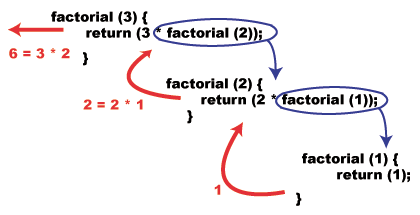

## What is recursion ?
It is a way we break a big problem into multiple sub problems to find the the solution.
As it is a function that calls itself either directly or indirectly therefore it is called recursion.

### Things to remember 
1. Think of base case with the notion that you have to break the problem into one or more smaller problems, and add one or more base conditions that stop recursion

``` {python}
def factorial(n):
    if n <= 1:
        return 1  # This is base case
    else:
       return n * factorial(n-1)
```
2. What are the disadvantages of recursive programming over iterative programming?
   1. Recursive program has greater space requirements than iterative program as all functions will remain in stack until base case is reached. 
   2. It also has greater time requirements because of function calls and return overhead.

3. What are the advantages of recursive programming over iterative programming?
Recursion provides a clean and simple way to write code. 
   1. Some problems are inherently recursive like tree traversals, Tower of Hanoi, etc. 
   2. They are simple to design.

### Famous Examples:

1. Factorial
2. Fibonacci
3. Recursive Selection sort
4. Recursive Bubble Sort
5. Recursive Insertion Sort
6. Given a string, print all possible palindromic partitions
7. Check if a number is Palindrome
8. Print all possible strings of length k that can be formed from a set of n characters
9. Find all even length binary sequences with same sum of first and second half bits
10. Print all possible expressions that evaluate to a target
11. String with additive sequence
12. Generate all binary strings without consecutive 1’s
13. Recursive solution to count substrings with same first and last characters
14. All possible binary numbers of length n with equal sum in both halves
15. Combinations in a String of Digits
16. Count consonants in a string (Iterative and recursive methods)
17. Program for length of a string using recursion
18. First uppercase letter in a string (Iterative and Recursive)
19. Partition given string in such manner that i’th substring is sum of (i-1)’th and (i-2)’th substring
20. Power Set in Lexicographic order 
21. Function to copy string (Iterative and Recursive)
22. Print all possible combinations of r elements in a given array of size n
23. Print all increasing sequences of length k from first n natural numbers
24. Generate all possible sorted arrays from alternate elements of two given sorted arrays
25. Program to find the minimum (or maximum) element of an array
26. Sum triangle from array
27. Reverse a stack using recursion
28. Sort a stack using recursion
29. Recursive function to delete k-th node from linked list
30. Recursive insertion and traversal linked list
31. Reverse a Doubly linked list using recursion
32. Delete a linked list using recursion
33. Print alternate nodes of a linked list using recursion
34. Recursive approach for alternating split of Linked List
35. Find middle of singly linked list Recursively
36. Print all leaf nodes of a Binary Tree from left to right
37. Leaf nodes from Preorder of a Binary Search Tree (Using Recursion)
38. Print all longest common sub-sequences in lexicographical order
39. Recursive Tower of Hanoi using 4 pegs / rods
40. N Queen

There are alot of such problems that can be addressed using recursion, but the above ones are just a gist to understand the scope of recursion. In the following series in the articles, we will develop a capability to adress some complex problems.

