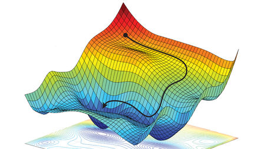

# Practices in Deep Learning

While working with deep learning models, it becomes quite irritating and frustrating sometimes when you try to find the optimal hyperparameters. Whether you start with the new architecture of your own, or take a proven architecture, or even start from the transfer learning, hyper parameters are every where. 

So, after spending a lot of time and banging my head tuning the models, I discovered some must try practices. Heres the list:

## Learning Rate:
1. While using a pretrained model, that was trained on some other dataset example ImageNet for Image Classification: Don't use the same learning rates for modelling the new datasets.
2. Use Learning Rate Finder [Learning Rate finder](https://arxiv.org/pdf/1506.01186.pdf):
   1. Lets start with a tiny learning rate like 1e-10 and then exponentially increase it with each training step.
   2. Then train your network as usual.
   3. Do add the training loss to the summary and monitor it until it grow rapidly.
   4. Tensorboard is must: Visualize the training loss here.
    > You need to find the section where loss is decreasing fastest, and use the learning rate that was being used at that training step.
    [Github](https://github.com/cahuja1992/learning-rate-finder-tensorflow)
3. Don't use a single learning rate throughout all the training steps, use something like cosine_decay.
[Cosine Annealing](https://www.tensorflow.org/api_docs/python/tf/train/cosine_decay)

## Activation functions:

## Training:

## Architectures:

## Data Set: